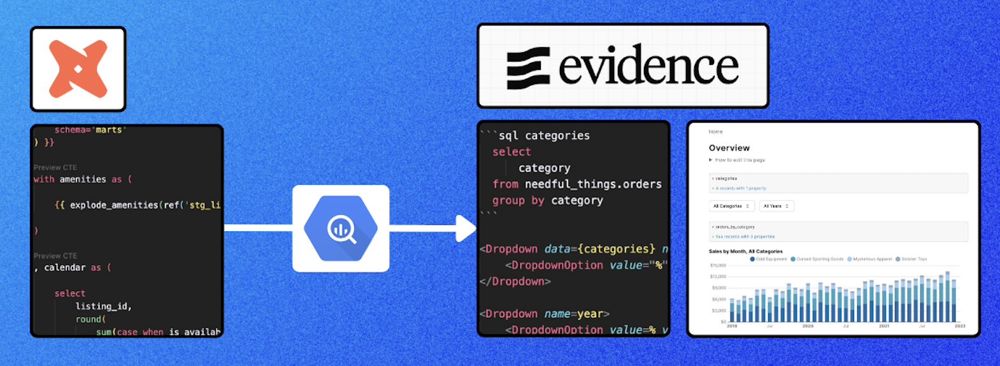
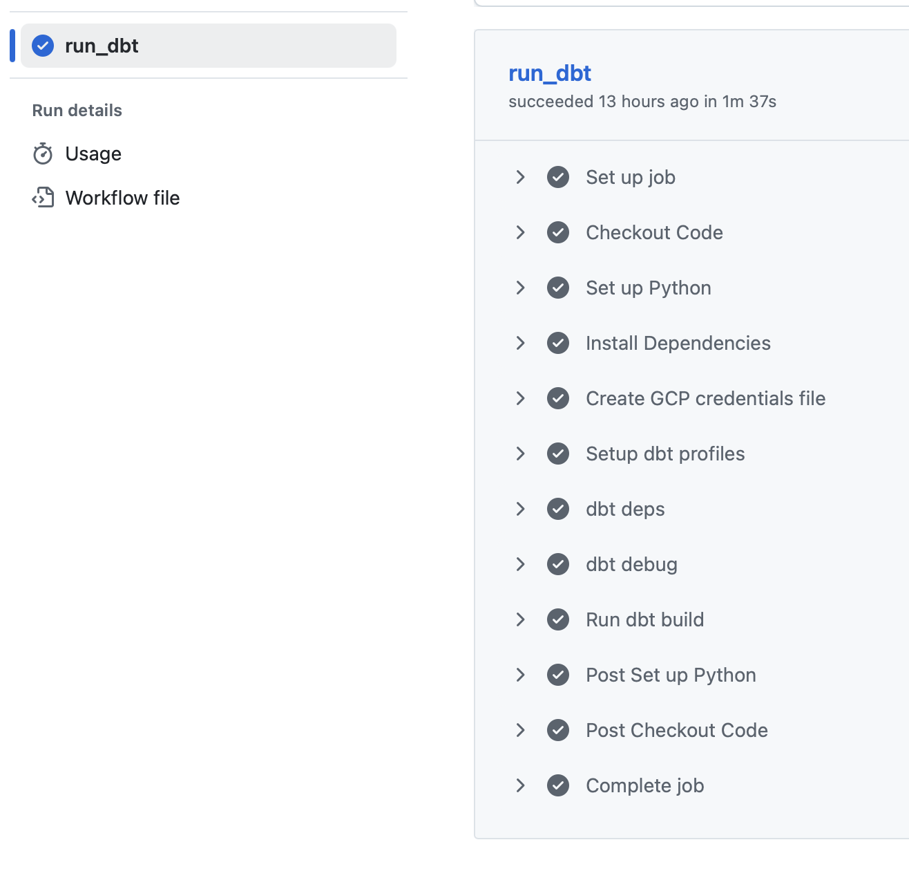
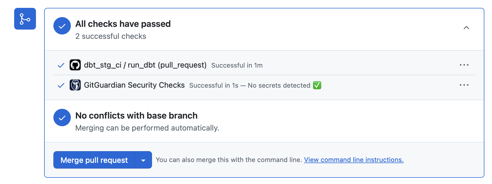
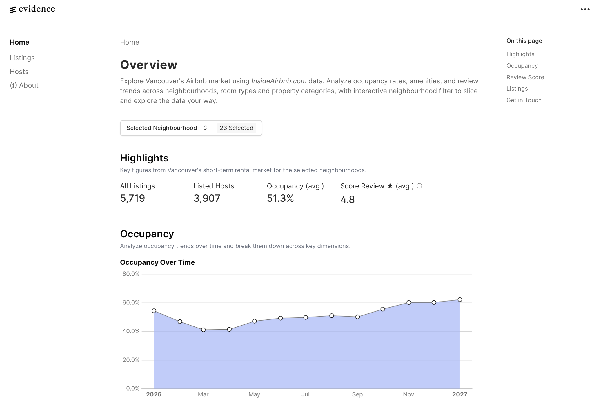

# Data Analytics Engineering Project: dbt, BigQuery & Evidence

This project aims to build an **end-to-end analytics pipeline**, from data transformation to data visualisation. Data is sourced from [Inside Airbnb](https://insideairbnb.com/get-the-data/)

### ✅ 1. Project Overview

The project implements a modern data pipeline using BigQuery, dbt and Evidence:
- Load raw data into **BigQuery**
- Transform data into analytics-ready table using **dbt**
- Visualize data in **Evidence** through interactive dashboard



### 📂 2. Project Structure

```
my_project/
│
├── macros/             # Explode amenities into one row per amenity
├── models/
│   ├── staging/        # Cleaned raw data, contracted staging tables
│   ├── intermediate/   # Processed data for transformation
│   └── marts/          # Business-ready tables (Dim/facts models)
|
├── reports/            # Dashboard Implementation (dashboard implementation)
│   ├── sources/        # Connection to the created marts models with dbt
│   ├── pages/          # Developped dashboard pages
|
├── seeds/              # Dummy CSV (neighbourhood coordinates (latitude and longitude))
├── tests/              # Business logic tests
|             
├── profiles.yml
└── README.md
```

Generate and serve documentation locally:

```
dbt deps
dbt docs generate
dbt docs serve
```

### ☑️ 3. Dbt Testing

- 3.1. Generic tests: to **validate business rules**

    - ```unique```
    - ```not_null```
    - ```relationships```
    - ```accepted_values```
    - ```dbt_utils.accepted_range```

```
- name: listing_monthly_metrics
    description: "Aggregated monthly occupancy metrics by listing."
    columns:
      - name: month_date
        description: "Calendar date truncated to the month level."
        tests:
          - not_null
   - name: num_available_nights
         description: "Total number of night"
         tests:
            - dbt_utils.accepted_range:
               arguments:
                  min_value: 0
                  max_value: 31
```

- 3.2. Singular tests: to **validate business logic**

```
select *
from {{ ref('listing_monthly_metrics') }}
where num_booked_nights = 0 and pct_occupancy > 0
```

- 3.3. Grain integrity tests: to **detect duplicates**

```
tests:
      - dbt_utils.unique_combination_of_columns:
          arguments:
            combination_of_columns: ['month_date', 'host_id', 'listing_id']
```

### ⚙️ 4. Continous Integration

To ensure data quality and prevent broken transformations from being merged, the project includes a **GitHub Actions CI pipeline** that automatically validates dbt changes on every pull request and push to the main branch.

The workflow creates an automated quality gate that ensures:
- BigQuery credentials and connectivity are valid.
- SQL models compile successfully.
- Data quality tests pass.
- Changes do not introduce breaking transformations.

If any model or test fails, the GitHub Action fails and the pull request is flagged before being merged.

<table>
  <tr>
    <td width="50%">
      
    </td>
    <td width="50%">
      
    </td>
  </tr>
</table>

### 📈 5. Building the BI tool with Evidence
> Evidence is an open source framework for building data products with SQL - things like reports, decision-support tools, and embedded dashboards. It's a code-driven alternative to drag-and-drop BI tools.

I chose Evidence because it **combines the flexibility of a code-first analytics platform with the usability of a modern, intuitive user interface**.
- On the backend, Evidence integrates with my dbt project and BigQuery environment. **Updates can be implemented and deployed quickly while remaining aligned with the underlying data models**.
- On the frontend, Evidence **offers a clean and engaging user experience that goes beyond traditional drag-and-drop dashboards**. This approach makes insights more accessible, encourages exploration, and helps foster a stronger data-driven culture among users.


### 📊 6. Dashboard
This dashboard is an **interactive exploration tool** built to analyze Vancouver's short-term rental market.

Rather than static reports, it is designed to let you **navigate the data your way**, drilling down from city-wide trends to individual listings and hosts through clicks and filters.

The dashboard is structured as a **drilldown experience** across four levels:

- **Overview:** key metrics across all neighbourhoods (occupancy trends, listing distribution, review scores, and property types) 
- **Neighbourhood:** explore occupancy over time across all neighbourhood, top listings, and how it compares to the Vancouver average 
- **Listing:** explore individual profile (occupancy, booked nights over time, location, review scores by category, and host details)
- **Host:** Check full profile (number of listings, time hosting, ratings, and reviews)

What's measured:

- **Occupancy Rate:** share of available nights that are booked
- **Booked Nights:** total nights booked over time
- **Review Scores:** broken down by accuracy, cleanliness, check-in, communication and location
- **Host Profile:** experience, portfolio size and guest ratings



In the meantime, while the application is being deployed, feel free to explore the dashboard through the video below.

### ↗️ 7. Future Improvements

- Schedule dbt models for automated runs
- Automate data ingestion from Inside Airbnb (e.g., with Airflow)
- Integrate Evidence into the organization’s project to incorporate testing within the GitHub CI pipeline.
- Embed the application for direct access and demonstration purposes.

### 🛠️ 8. Technology Stack
- dbt, SQL, GitHub, Evidence, VS Code

### 🛠️ 9. Data Sources
- [InsideAirbnb.com](https://insideairbnb.com).

### 👨‍💻 10. Author
**Jacques Hervochon** 
🟦 [LinkedIn](https://www.linkedin.com/in/jacques-hervochon-27448898) |
🔗 [Portfolio](https://jacqueshervochon.carrd.co/#) |
📆 [Book a call](https://calendly.com/jacqueshervochon/30min)

### 📄 11. License 
This project is licensed under the MIT License.
